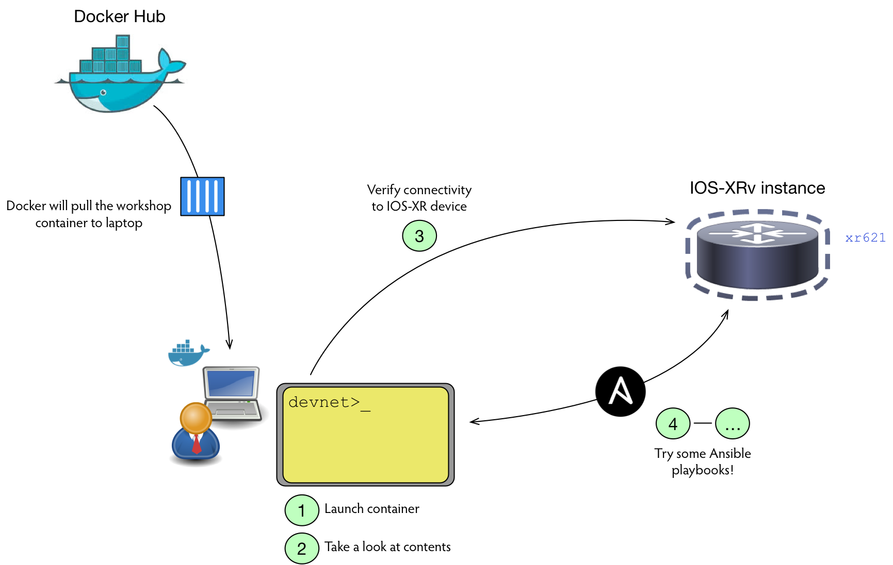

# __Cisco Live 2017 - DEVNET-1223__
Workshop: Automating IOS-XR with Ansible

## Learning objectives
Upon completing this workshop you should have:

  * Quick overview of Ansible
  * Steps & references to enable IOS-XR for Ansible  
  * Overview of automating legacy functions with core Ansible modules (for IOS-XR)
  * Brief introduction to creating custom Ansible modules (with YDK)

## Workshop workflow


## Steps

### 1. Instantiate container
From a terminal window on the workshop laptop run `~/xransible.sh`:

```commandline
$ ~/xransible.sh
devnet:~$
```
The script will instantiate a container on the laptop with Ansible installed on Alpine
Linux. You should see a command prompt as the ‘devnet’ user within the container.

### 2. Familiarize yourself with the container contents

Use the `tree .` or `ls –R` commands to take a quick look at the files and directory
structure (there’s a little more than what’s shown here):

```commandline
.
├── README.md
├── ansible.cfg
├── documents
├── inventory
│   ├── group_vars
│   │   └── test-routers.yaml
│   ├── host_vars
│   │   └── sample-host.yaml
│   └── hosts
├── library
│   ├── ydkMACsecModule.py
│   └── ydkOspfModule.py
├── playbooks
│   ├── create-user.yaml
│   ├── delete-user.yaml
│   ├── iosxr-command.yaml
│   ├── iosxr-config.yaml
│   ├── iosxr-getfacts.yaml
│   ├── iosxr-system.yaml
│   ├── iosxr-template.yaml
│   ├── macsec-createkeychain.yaml
│   ├── macsec-deletekeychain.yaml
│   ├── ospfTest1.yaml
│   ├── ospfTest2.yaml
│   ├── secrets.yaml
│   └── set-snmp.yaml
├── requirements.txt
```

The ~/ansible.cfg file contains a few Ansible settings specific to this workshop. The
global settings are normally good enough, but there are lots of possible overrides
(see http://docs.ansible.com/ansible/intro_configuration.html).

Within this lab, the target host(s) is specified under ~/inventory (in the “hosts” file).
Normally the default location is `/etc/ansible/hosts`, but we’re using a configuration
setting (“hostfile”) in the `~/ansible.cfg` to override that and point it to the
`~/inventory` directory. Using a directory has the advantage of allowing Ansible to load
multiple inventory sources at the same time, including the ability to mix in dynamic
inventory, possibly generated by executable scripts or programs in that directory.

The `~/playbooks` directory contains several sample playbooks that make use of the core
IOS-XR Ansible modules, as well as examples of using some custom modules.

The user credentials in the sample playbooks are being loaded from
`~/playbooks/secrets.yaml`. Those could also come from variables in the
`~/inventory/group_vars` and/or `~/inventory/host_vars` directories. You might do that
if you had unique credentials on a particular device for example.

### 3. Verify connectivity to IOS-XR device

SSH to router xr621 as user “cisco”, password “cisco” (and then exit):

```commandline
devnet:~$ ssh cisco@xr621
Password:

RP/0/RP0/CPU0:xr621#
RP/0/RP0/CPU0:xr621# exit
```

### 4. Ansible raw command

The Ansible core raw command does not go through the module subsystem and is useful for ad-hoc
or one-off commands over SSH, targeting a single device or group of devices (groups based on
the Ansible hosts file). Normally Ansible dynamically builds a Python program to execute a
playbook task and pushes the program over SSH to the target device for execution locally on
that device. Therefore raw is especially useful for devices that do not support remote Python
execution (like some network devices).

From the devnet container you can run the following sample show command. The first argument,
`xr621`, indicates the device (or group name) to target. The `-u cisco` specifies the username
credential to log in with and the `-k` indicates that it should prompt you for the password.
The `-m raw` is the name of the module to run (somewhat misleading with raw) and the `-a` is
a list of arguments to pass to the module.

Try running the following command. Feel free to try other show commands you might normally run from the IOS-XR command line:

```commandline
devnet:~$ ansible xr621 -u cisco -k -m raw -a "show install active"
SSH password:
xr621 | SUCCESS | rc=0 >>
Thu Jun 15 20:10:47.059 UTC
Node 0/RP0/CPU0 [RP]
  Boot Partition: xr_lv0
  Active Packages: 1
  xrv9k-xr-6.2.1 version=6.2.1 [Boot image]

Node 0/0/CPU0 [LC]
  Boot Partition: xr_lcp_lv0
  Active Packages: 1
  xrv9k-xr-6.2.1 version=6.2.1 [Boot image]

Shared connection to xr621 closed.
```
Reference: http://docs.ansible.com/ansible/raw_module.html

### 5. Ansible Core Module: iosxr_command

The Ansible *iosxr_command* module sends one or more commands to remote devices and returns the
output. You send a single command or a list of commands. The YAML syntax for a list has each
item on a separate line prefaced by a `-`.

Within the devnet container we’ve included a `iosxr-command.yaml` playbook under `~/playbooks`
that shows an example of a list of two commands. You can do a `more ~/playbooks/iosxr-command.yaml`
to see the contents:

```yaml
---
  hosts: test-routers
  gather_facts: false
  connection: local
  vars_files:
    - secrets.yaml
  tasks:
    - name: Run some commands
      iosxr_command:
        commands:
          - show version
          - show interfaces brief
      provider: "{{ credentials }}"
      register: result
    - debug: var=result.stdout_lines
```

Notice the value of the *hosts* variable. It’s referring to a group, *test-routers*, which
itself is defined in the `~/inventory/hosts` file. In our workshop that group only has a
single member, *xr621*, which is found in the `/etc/hosts` file.

To run this playbook against the xr621 router, use the following command:

```commandline
devnet:~$ ansible-playbook ~/playbooks/iosxr-command.yaml
```

The return values should include the output of `show version` and `show interfaces brief`
such as:

```commandline
TASK [debug] ***************************************************************************************
ok: [xr621] => {
"result.stdout_lines": [
        [
            "Cisco IOS XR Software, Version 6.2.1",
            "Copyright (c) 2013-2017 by Cisco Systems, Inc.",
            "",
            "Build Information:",
            " Built By     : ahoang",
            " Built On     : Sat Mar 11 15:37:11 PST 2017",
            " Build Host   : iox-lnx-066",
            " Workspace    : /auto/srcarchive17/production/6.2.1/xrv9k/workspace",
            " Version      : 6.2.1",
            " Location     : /opt/********/XR/packages/",
            "",
            "******** IOS-XRv 9000 () processor ",
            "System uptime is 5 weeks, 4 hours, 33 minutes"
        ],
        [
            "Intf       Intf        LineP              Encap  MTU        BW",
            "               Name       State       State               Type (byte)    (Kbps)",
            "--------------------------------------------------------------------------------",
            "                Lo2          up          up           Loopback  1500          0",
            "               Lo21          up          up           Loopback  1500          0",
            "                Nu0          up          up               Null  1500          0",
            "     Mg0/RP0/CPU0/0          up          up               ARPA  1514    1000000",
            "          Gi0/0/0/0  admin-down  admin-down               ARPA  1514    1000000",
            "          Gi0/0/0/1  admin-down  admin-down               ARPA  1514    1000000",
            "          Gi0/0/0/2  admin-down  admin-down               ARPA  1514    1000000"
        ]
PLAY RECAP ***************************************************************************************
xr621                      : ok=2    changed=0    unreachable=0    failed=0
```

Reference: http://docs.ansible.com/ansible/iosxr_command_module.html

### 6. Custom Module with YDK: MACsec keychains

Ansible comes with lots of built-in modules to leverage in playbooks or directly against remote
hosts and network devices. However, the need might arise to do something that is not supported
by any of the existing modules. For this workshop, we decided to see how easy it would be to
have Ansible interface to IOS-XR through the [YANG Development Kit (YDK)](https://github.com/CiscoDevNet/ydk-gen).

YDK facilitates network automation by turning YANG data models into APIs that mirror the structure
of the models. These APIs can then be leveraged in a variety of programming languages to create
applications. In this case, we are using the YDK APIs in a couple of example custom Ansible
modules written in Python.

If you are not familiar with programming or Python, it should still be of interest to see how the
use of a data model + API approach can make the Ansible playbooks more readable for a particular
feature. An Ansible playbook is a type of data model in itself and a module written in this way
is effectively translating a playbook’s task contents into one or more YDK data models to pass
along to the target network device(s).

For this example, take a look at the first (and only) task in the `~/playbooks/macsec-createkeychain.yaml` playbook:

```yaml
---
  tasks:
    - name: Initial keychain for MACSec
      ydkMACsecModule:
        keychain: CHAIN1
        state: present
        keys:
          10:
            key-string: '12485546375E5450087E727C6061754654325623030D0F710357544F417A0E01050102015F0853510C03514353510B585629716A1E5A495042315E5C50097F7778'
            algorithm: aes-256-cmac
            lifetime:
              start-time: '00:00:00 AM'
              start-date: 1-Jan-2017
          20:
            key-string: '11594D5544472859547F0A737D62137330524E5750030B0C020059563E437F0D01'
            algorithm: aes-128-cmac
            lifetime:
              start-time: '00:00:00'
              start-date: 1-May-2017
              end-time: '11:59:59p'
              end-date: 31-Dec-2017
        provider: "{{ ydk }}"
      register: result
    - debug: var=result
```

First, you can see the reference to the custom module in line 3, *ydkMACsecModule*. Ansible will
look for that module in its module search path, which in this case includes the `~/library`
directory under the devnet user (see the settings in `~/ansible.cfg`). It will call that module
and pass it the parameters from lines 4 – 21. It is then up to the module to map those parameters
into the appropriate data model(s) via the YDK API. In this case, the *ydkMACsecModule* is built
around this data model:
https://github.com/YangModels/yang/blob/master/vendor/cisco/xr/621/Cisco-IOS-XR-lib-keychain-macsec-cfg.yang

Go ahead and run that playbook now:

```commandline
devnet:~$ ansible-playbook playbooks/macsec-createkeychain.yaml
```

The playbook should complete successfully and indicate a change was made to the router. If you then SSH into the router and do a `show config`, you should hopefully see the newly-created keychain.

If you rerun the same module again:

```commandline
devnet:~$ ansible-playbook playbooks/macsec-createkeychain.yaml
```

The playbook should still complete successfully, but this time indicating no change was made.
This highlights the module’s ability to be idempotent, which means it detected the configuration
(as defined in the playbook task) was already present on the target router and therefore no
change was needed. Ansible in general emphasizes idempotency.

Now look at the `~/playbooks/macsec-deletekeychain.yaml` playbook. The key difference is the
state for the CHAIN1 keychain is defined as “absent”, which the module interprets as meaning
the target device configuration should not have that keychain in it.

Run the playbook to remove the keychain:

```yaml
devnet:~$ ansible-playbook playbooks/macsec-deletekeychain.yaml
```

The playbook should complete successfully and indicate a change was made to the router. A
`show config` on the router should now show that the MACsec keychain has been removed.

### 7. Ansible Core Module: iosxr-config (optional)

The Ansible *iosxr_config* module is used to send arbitrary configuration commands in block
indent style. Two options worth noting are:

  * *src*, added in Ansible 2.2, allows you to identify a source file (or template) to load a
  configuration from.
  * *backup*, added in Ansible 2.2, will have the module create a full backup of the current
  running-configuration from the remote device before changes are made.

For this example, take a look at the `create-user.yaml` playbook located within the `~/playbooks`
directory:

```yaml
---
  hosts: test-routers
  gather_facts: false
  connection: local
  vars_files:
    - secrets.yaml

  tasks:
    - name: Create new user
      iosxr_config:
        lines:
          - group root-lr
          - secret {{ password }}
        parents: username {{ newuser }}
        provider: "{{ credentials }}"
        backup: yes
      register: result
    - debug: var=result
```

This playbook utilizes the *iosxr_config* module to create a user *{{ newuser }}* with password
*{{ password }}* within group *root-lr*. The double-braces, *{{ }}* (referred to as “mustache
syntax”), around *newuser* and *password* allows these values to be taken from command line
arguments to the `ansible-playbook` run or from group or host-specific variables. This is simply
one example of how to use command line arguments within a playbook.

Also note the *backup* option is enabled within this playbook.

To run this playbook, use the following command from the devnet container:

```commandline
devnet:~$ ansible-playbook ~/playbooks/create-user.yaml --extra-vars="newuser=devnet password=cisco"
```

Running this playbook should generate output similar to the following:

```commandline
devnet:~$ ansible-playbook ./playbooks/create-user.yaml --extra-vars="newuser=devnet password=cisco"    

PLAY [test-routers] ********************************************************************************************

TASK [Create new user] ********************************************************************************************
changed: [xr621]

TASK [debug] ********************************************************************************************
ok: [xr621] => {
    "result": {
        "backup_path": "/app/playbooks/backup/xr621_config.2017-06-22@21:25:13",
        "changed": true,
        "commands": [
            "username devnet",
            "secret cisco"
        ],
        "diff": {
            "prepared": "Building configuration...\n!! IOS XR Configuration version = 6.2.1\n   username devnet\n<-  secret 5 $1$hyiT$sEDFA4NysL0c/ntW77LQZ.\n+>  secret 5 $1$VCaQ$prHvVkSyNK/BhIIWL1LEb1\n   !\nend"
        }
    }
}

PLAY RECAP *********************************************************************************************
xr621                      : ok=2    changed=1    unreachable=0    failed=0
```

After running the playbook, take a look within the `~/playbooks` directory. You should see that
a `backup` directory was created, along with a file containing the backup configuration:

```commandline
devnet:~$ ls ~/playbooks/backup/
xr621_config.2017-06-22@21:25:13
```

As an additional step, take a look at the `delete-user.yaml` playbook, also within the
`~/playbooks` directory. You can utilize this to delete the user that was just created:

```commandline
devnet:~$ ansible-playbook ~/playbooks/delete-user.yaml --extra-vars="user=devnet"
```

## Enabling IOS XR for Ansible
There are three general ways to access IOS-XR with Ansible:
  * Console/Line CLI (Local)  
  * API (Local)
  * Access the Global VRF on IOS-XR Linux Shell (Remote or Local)

In addition, when creating playbooks Ansible can be specified to run on the remote node or
the local server. The difference between the two is where the module or script is being run.

### Local
In the case of local mode, Ansible will run the module/script on the local server. In this
mode, a connection has to be established to the remote node. When using local mode, the
Ansible network module is used to establish an SSH connection to the IOS-XR console to run
commands.

There are two general ways to access IOS-XR in local mode, Console/Line CLI and API.

### Console or Line Command Line Interface (CLI)
With this method, Ansible connects to the remote node via SSH to port 22 and issues IOS-XR
command line commands. This is useful when utilizing the Ansible core modules such as
*iosxr_command* and *iosxr_config*.

SSH generally requires a hostname and domain name, then crypto keys, and any additional
(organizational) requirements for SSH.

An overview of prerequisites and configuration steps are as follows.

#### Prerequisites
  * The user must be in a user group associated with a task group that includes the proper task
  IDs. The command reference guides include the task IDs required for each command.
  * The SSH server and SSH client require you to have a crypto package (e.g. k9-sec.pie) installed
  and active on your router.
  * To run an SSHv2 server on IOS-XR, you must have a VRF. This can be the default VRF or a
  specific VRF.
  * Proper user authentication configured for local or remote access (with or without AAA).

#### Configuration Steps

```commandline
configure terminal
  hostname hostname
  domain name domain.name
  commit
  exit
crypto key generate rsa [usage keys | general-keys]
crypto key generate dsa
configure terminal
  ssh timeout seconds
  ssh server [ vrf vrf-name]
  ssh server v2
  commit
  exit
```

Once SSH is enabled, you can configure authentication via ssh-keys from your Ansible platform to
your IOS-XR device. The following example uses a TFTP server from which to import keys onto the
router.

#### Components
  * Linux system with Ansible installed, along with a TFTP server
  * IOS-XR Router running IOS-XR 6.1.1 or higher

#### Server commands
  * Create a 1024-byte key:
```commandline
$ ssh-keygen -b 1024 -t rsa
Generating public/private rsa key pair.
Enter file in which to save the key (/home/joerober/.ssh/id_rsa):
```
  * Cut and copy the generated key into base64
```commandline
$ cut -d" " -f2 ~/.ssh/id_rsa.pub | base64 -d > ~/.ssh/xrdev_rsa_pub.b64
```
  * Copy key to tftpboot directory
```commandline
$ cp ~/.ssh/xrdev_rsa_pub.b64 /var/lib/tftpboot/
```

#### IOS-XR Router commands
After logging on to router, import key:

```commandline
RP/0/RP0/CPU0:xr621# crypto key import authentication rsa tftp://172.16.255.47/xrdev_rsa_pub.b64
```

With the crypto key imported, you should now be able to log into the router via ssh-key (i.e.
no password).

### API

Creating custom Ansible modules allows the user to capitalize on model-driven APIs and provides
a migration path towards further automation beyond the limitations of legacy functions.

There are several ways to access IOS-XR via API in local mode:
  * NETCONF 1.0: connect with NETCONF over SSH with IOS-XR netconf 1.0 agent
  * NETCONF 1.1: connect NETCONF over SSH with IOS-XR netconf-yang 1.1 agent
  * Access Global VRF on IOS -XR Linux: This is outside the scope of DEVNET-1223 and is explained within the remote section.

This document provides commands for accessing an IOS-XR device via NETCONF. Further information
on the IOS-XR XML Agent and access to IOS-XR Linux shell can be found within the IOS-XR
configuration guides on http://www.cisco.com

The following covers the prerequisites and an overview of commands to enable NETCONF on IOS-XR.

#### Prerequisites
  * Configure SSH (reference Console CLI section)

#### Configuration Steps
```commandline
configure terminal
  netconf-yang agent ssh
  ssh server netconf vrf default
  ssh server netconf port 830
  commit
  exit
```

### Remote

When using the remote connection method, Ansible first attempts to establish an SSH connection
to the device. Once established, Ansible then transfers the module/script onto the device and
executes on the remote node under a Python interpreter. Within IOS-XR remote mode will require
setting up access to the Global VRF on the Cisco IOS -XR Linux Shell (IOS-XR Version 6.0.2 and
higher; prior to 6.0.2 this is referred to as *Third-Party Network Namespace (TPNNS)*).

Accessing the Global VRF on the Cisco IOS-XR Linux Shell is outside the scope of the DEVNET-1223
workshop. Further information and details can be found within the [IOS-XR Application Configuration
Hosting Guide](
http://www.cisco.com/c/en/us/td/docs/iosxr/ncs5500/app-hosting/b-application-hosting-configuration-guide-ncs5500.html)

Note: useful information on IOS-XR users and groups inside IOS-XR Linux can be found [here](
https://xrdocs.github.io/software-management/blogs/2016-10-17-ios-xr-users-and-groups-inside-linux/).

Finally, a playbook to automate access to the Global VRF on IOS-XR Linux, which contains the
steps to enable access to the Global VRF, is as follows:

Two caveats:
  * User assumes all responsibility and risk
  * This requires root access within the IOS-XR Linux Shell

`sshd_operns.yaml` playbook:
```commandline
---
  hosts: edge
  gather_facts: false
  tasks:
  - name: enter bash
    raw: run chkconfig --add sshd_operns
  - name: start sshd_operns
    raw: run service sshd_operns start
  - name: check sshd status
    raw: run service sshd_operns status
  - name: chkconfig of sshd_operns
    raw: run chkconfig --list sshd_operns
    register: output
  - debug: var=output.stdout_lines
```

Once access is configured, an additional option is to copy your user ssh-key from the Ansible
host onto the IOS-XR device (IOS-XR Linux Shell). This can be done from the Ansible server
command line via the following:

```commandline
devnet$ ssh-copy-id -i ~/.ssh/id_rsa.pub -p 57722 [ iosxr-hostname | iosxr-ipaddress ]
```
